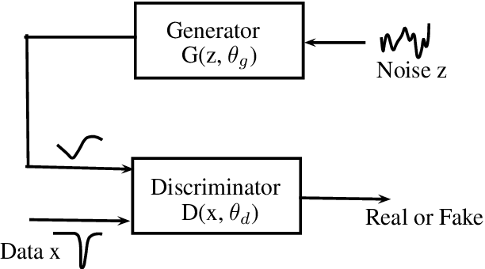
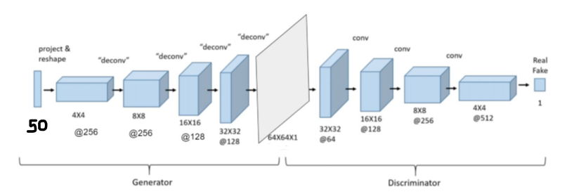

## Deep Convolutional GAN

-   Here I tried to implement a DCGAN to understand how a GAN works and its use cases.

-   Since I am also deeply intrigued and passionate of the medical industry, I decided to use a medical dataset.

#### What are GANs

-   GANs are generative models. Generative models try to generate data from a given (complex) probability distribution.

-   Deep learning generative models are modelled as neural networks that take as input a simple random variable and that return a random variable that follows the targeted distribution.

-   A GAN consists of 2 components, a Generator and a Discriminator

    

-   GANs are a clever way of training a generative model by framing the problem as a supervised learning problem with two sub-models

    -   The generator model that we train to generate new examples
    -   The discriminator model that tries to classify examples as either real (from the domain) or fake (generated). 
    -   The two models are trained together in a zero-sum game, adversarial, until the discriminator model is fooled about half the time, meaning the generator model is generating plausible examples.

-   Better detailed explanation can be found [here](https://machinelearningmastery.com/what-are-generative-adversarial-networks-gans/).

#### Motivation and Dataset

-   In this dataset, there are 200 images of Brian CT scans. 100 with hemorrhage and 100 without.

-   Since the dataset is so small, GANs was used to synthetically generate more training data.

-   The idea and motivation came from this paper : [ Synthetic Data Augmentation Using GAN for Improved Liver Lesion Classification](www.eng.biu.ac.il/goldbej/files/2018/01/ISBI_2018_Maayan.pdf).

-   The dataset can be found on Kaggle [here](https://www.kaggle.com/felipekitamura/head-ct-hemorrhage).

#### Architecture

-   Chose to use the default model given in the base paper initially. Later changed it slightly to reduce the size of the random input vector.

-   Final Architecture was :

    

#### Running the code

-   The [GAN_Implementation.ipynb](https://github.com/AceEV/DCGAN/blob/master/GAN_Implementation.ipynb) contains the code for the GAN architecture and generates new training examples. 
-   The code was written and run on Google Colab, using TPU.
-   The [final_classifier.ipynb](https://github.com/AceEV/DCGAN/blob/master/final_classifier.ipynb) is used to perform the actual classification on the dataset, with the GAN generated images in the training data.

#### Some challenges faced along the way

-   The model took a long time to generate precise images that can be used for training, although it was able to figure out the exteriors very quickly.
-   The biggest problem faced was that of _model collapsing_ wherein the model kept generating the same image for all inputs.
    -   The solution to this is find a good learning rate and stick to it. There are many other proposed solutions online and there is no set method to solve this problem.
-   To increase the precision, changing the model architecture to include more nodes and making the model more complex will help.
